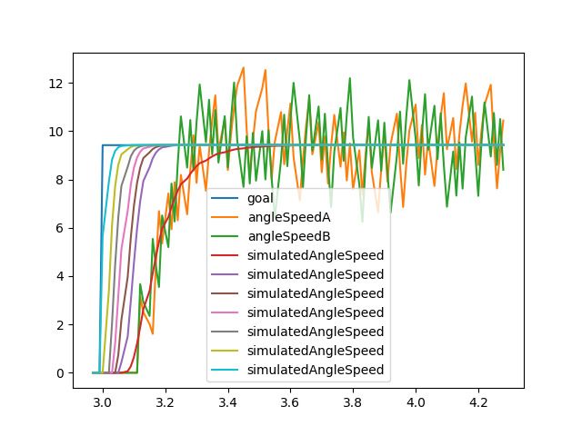

# Designing Inverted Pendulum

This is a repository for desining an affordable inverted pendulum.

## Setup

Python dependencies are managed with [uv](https://docs.astral.sh/uv/). Install it if you have not already:

```bash
curl -LsSf https://astral.sh/uv/install.sh | sh
```

Then create the environment from the lockfile:

```bash
uv sync
```

This creates `.venv/` with the exact versions pinned in `uv.lock` (Python >= 3.10 required; uv downloads a suitable interpreter automatically).

Run any script with `uv run` — no manual activation needed:

```bash
uv run python scripts/bests/at-2026-08-15/design_best_R14_controller.py
```

To add or update a dependency:

```bash
uv add <package>          # add and update the lockfile
uv lock --upgrade         # refresh all pinned versions
```

The Arduino side needs the `Adafruit BNO055`, `Adafruit Unified Sensor`, and `MsTimer2` libraries, installable from the Arduino IDE library manager.

## Demo

<video src="https://github.com/wattai/affordable-inverted-pendulum/raw/main/videos/VID_20260815_231143121.mp4" controls width="480"></video>

▶ [videos/VID_20260815_231143121.mp4](videos/VID_20260815_231143121.mp4) — the robot balancing with the controller described below.

## Current best design (2026-08-15)

The robot balances with a **10-state model + steady-state Kalman observer + discrete LQR**, running at 100 Hz on an Arduino Uno.

The state vector augments the usual 4 balance states with a 6-stage approximation of the input dead time:

$$
x = \begin{bmatrix}\theta & \dot\theta & \varphi & \omega & z_1 & \cdots & z_6\end{bmatrix}^{\mathsf T}
$$

where $\theta$ is the body angle, $\varphi$ / $\omega$ the averaged wheel angle / speed, and $z_1..z_6$ a cascade of first-order lags approximating $L_d = 0.1$ s of actuation delay.

The plant is built from measured physical parameters, discretized with zero-order hold at $T_s = 10$ ms, and fed to a discrete LQR:

$$
x[k+1] = A_d x[k] + B_d u[k],\qquad
K = \left(R + B_d^{\mathsf T} P B_d\right)^{-1} B_d^{\mathsf T} P A_d,\qquad
u[k] = -K\,\hat x[k]
$$

with $Q = \mathrm{diag}(10, 1, 0, 1, 0, \ldots, 0)$ and $R = 1.0$. Unobservable states are reconstructed by a steady-state Kalman observer, and only the first four gains are applied — feeding back $z_1..z_6$ directly was clearly worse on the real robot. The command $u$ (a wheel speed reference) then goes to a per-wheel leaky-PI loop with a left/right synchronization term.

**→ Full derivation, all matrices, gains, and known implementation caveats: [scripts/bests/at-2026-08-15/README.md](scripts/bests/at-2026-08-15/README.md)**

## Repository layout

| Path | Contents |
| --- | --- |
| [scripts/bests/](scripts/bests/) | Snapshots of the best-performing configurations, with the design script and the exact sketch flashed to the robot |
| [scripts/system-design/](scripts/system-design/) | Model / LQR / observer design experiments (`calc-optimal-gain-*.py`) |
| [scripts/motor-calibration/](scripts/motor-calibration/) | Motor and encoder calibration scripts |
| [scripts/arduino/](scripts/arduino/) | Arduino sketches, including earlier stable versions |
| [data/](data/) | Calibration logs and plots |

## Motor dead time measurement

The step response below is where the $L_d = 0.1$ s dead time in the model comes from — the delay between the speed command and the wheel actually responding, which the $z_1..z_6$ cascade approximates.


