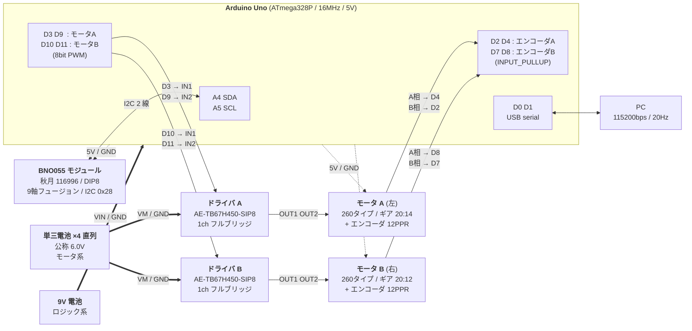

# ハードウェア仕様

最新のスケッチ [scripts/bests/at-2026-08-15/arduino_uno_sketch.ino](../../../scripts/bests/at-2026-08-15/arduino_uno_sketch.ino) から読み取れる範囲で、実機の構成を書き下したものです。設計スクリプトや過去の安定版スケッチとも突き合わせています。

**この文書は基本的にコードからの逆引きです。** 電源構成（§4）のみ実機からの情報で、型番など今なお確定できない項目は [§11](#11-コードから確定できない項目) にまとめてあります。

---

## 1. 配線図

信号線はスケッチから確定した結線、電源系は実機の構成です。破線は Arduino のレギュレータから供給される 5V 系で、各デバイスへの分配はコードに現れないため推定です。

**モータ系とロジック系は別電源**で、GND のみ共通にしています。

TB67H450 は 1ch のフルブリッジなので、**モジュールを 2 枚使って左右のモータを駆動**しています。ロジック電源端子を持たない（VM のみで動く）構成なので、ドライバへの 5V 供給線はありません。

USB シリアルはテレメトリ確認用で、バランス動作そのものには不要です。

## 2. コントローラ

| 項目 | 値 | 出典 |
| --- | --- | --- |
| ボード | Arduino Uno（ATmega328P / 16 MHz / 5 V） | スケッチのファイル名・ヘッダコメント |
| 制御周期 | 10 ms（100 Hz）、`MsTimer2` によるタイマ割り込み | `CONTROL_PERIOD_MS = 10` |
| エンコーダ走査周期 | 最短 0.1 ms（10 kHz）、`loop()` 内でポーリング | `angleSensorTimeDeltaSec = 0.0001f` |
| シリアル | 115200 bps、テレメトリは 5 回に 1 回＝20 Hz | `Serial.begin(115200)`, `LOG_DIVIDER = 5` |

エンコーダは外部割り込みではなく **ポーリング** で読んでいます（ピン 2 は INT0 ですが割り込みは未使用）。

## 3. ピンアサイン

| ピン | 機能 | タイマ | 備考 |
| --- | --- | --- | --- |
| D2 | エンコーダ A 相 2 | — | `INPUT_PULLUP` |
| D3 | モータ A IN1（PWM） | **Timer2** | 下記 §12 の注意 |
| D4 | エンコーダ A 相 1 | — | `INPUT_PULLUP` |
| D7 | エンコーダ B 相 2 | — | `INPUT_PULLUP` |
| D8 | エンコーダ B 相 1 | — | `INPUT_PULLUP` |
| D9 | モータ A IN2（PWM） | Timer1 | |
| D10 | モータ B IN1（PWM） | Timer1 | |
| D11 | モータ B IN2（PWM） | **Timer2** | 下記 §12 の注意 |
| A4 / A5 | I2C SDA / SCL | — | BNO055 |

未使用：D0/D1（USB シリアル）、D5、D6、D12、D13、A0–A3。

### 結線表

**確定（スケッチに明記されている信号線）**

| 相手 | 相手側端子 | Arduino |
| --- | --- | --- |
| BNO055 | SDA | A4 |
| BNO055 | SCL | A5 |
| ドライバ A | IN1 | D3 |
| ドライバ A | IN2 | D9 |
| ドライバ B | IN1 | D10 |
| ドライバ B | IN2 | D11 |
| エンコーダ A | 相 1 | D4 |
| エンコーダ A | 相 2 | D2 |
| エンコーダ B | 相 1 | D8 |
| エンコーダ B | 相 2 | D7 |

エンコーダ 4 本はすべて `INPUT_PULLUP` で読んでいるため、オープンコレクタ／オープンドレイン出力のエンコーダであれば**外付けプルアップ抵抗は不要**です。同様に I2C も BNO055 ブレークアウト基板側のプルアップに依存しています。

**推定（コードに現れないため要現物確認）**

| 相手 | 相手側端子 | 接続先 |
| --- | --- | --- |
| BNO055 | VIN / GND | Arduino 5V / GND |
| エンコーダ A・B | Vcc / GND | Arduino 5V / GND |
| ドライバ A・B | VM / GND | 単三 NiMH ×4 |
| ドライバ A・B | RS / VREF | 電流制限の設定（モジュール上の実装は要確認） |
| ドライバ A | OUT1 / OUT2 | モータ A |
| ドライバ B | OUT1 / OUT2 | モータ B |

TB67H450 は **STBY / ENABLE 相当の端子を持たず**、IN1 / IN2 の 2 本だけで制御します（両方 Low がスタンバイ）。スケッチに待機制御のコードが無いのはこのためで、追加の固定配線も不要です。

モータの極性（AO1/AO2 の入れ替え）については、左右のエンコーダのカウント方向がソフト側で逆に定義されている（§7）一方、PWM 指令 `uA` / `uB` は同符号で扱われている点に注意してください。左右のモータは鏡像配置なので、**モータ配線かエンコーダ配線のどちらかが左右で入れ替わっている**構成になっています。

## 4. 電源

モータ系とロジック系を分離した 2 電源構成です。

| 系統 | 電源 | 公称電圧 | 供給先 |
| --- | --- | --- | --- |
| モータ | 単三ニッケル水素電池 ×4 直列（充電式） | **4.8 V**（1.2 V × 4） | H ブリッジの VM |
| ロジック | 9V 電池 | 9 V | Arduino VIN（内蔵レギュレータ経由で 5V 系へ） |

Arduino の 5V レギュレータ出力が、BNO055・エンコーダ・ドライバのロジック電源をまかなっています。

**2 電源構成なので、両電池の GND とドライバ GND・Arduino GND を必ず共通に接続してください。** 基準電位が揃っていないと PWM がドライバに正しく伝わりません。

実運用上の注意：

- **モータ電源の電圧がそのままループゲインに効きます。** 制御則は「車輪速度指令 → デューティ」という前提で設計されているため、実効的なモータゲインは VM の電圧にほぼ比例します。ゲイン調整の実験を比較するときは、**充電状態を揃える**必要があります。
- ニッケル水素は放電カーブが平坦（1 セルあたり約 1.2 V を長く維持し、終端で急に落ちる）なので、アルカリ乾電池よりループゲインが安定します。一方で終端に近づくと急激に電圧が落ちるため、**バランスが突然悪化したらまず充電**を疑うのが妥当です。内部抵抗が低く大電流を出せる点もモータ用途に向いています。
- §8 の $\tau_m = 0.07$ s と $L_d = 0.10$ s も、この 4.8 V 系での同定値です。電圧が変われば再同定が要ります。
- **9V 電池 → VIN は線形レギュレータでの損失が大きい**構成です（$(9-5)\times I$ がすべて熱になる）。BNO055 とエンコーダを合わせた消費電流次第では 9V 電池の持ちが短くなります。長時間の実験では、ロジック系も乾電池 + DC-DC に置き換える余地があります。
- モータ側の突入電流・逆起電力がロジック系に回り込まないという点では、この 2 電源構成は有利です（BNO055 のような I2C センサはリセットに弱いため）。

## 5. IMU

| 項目 | 値 |
| --- | --- |
| モジュール | 秋月電子 [116996] BNO055 使用 9 軸センサーフュージョンモジュールキット（DIP8 / 18 × 11 mm） |
| センサ | Bosch BNO055（加速度 ±2〜±16 g、角速度 ±125〜±2000 dps、地磁気 ±2500 μT） |
| 電源電圧 | 3.3 V〜5 V。**レギュレータとレベル変換回路を内蔵**しており Arduino Uno の 5V に直結可 |
| ライブラリ | Adafruit BNO055（Adafruit Unified Sensor 依存） |
| インタフェース | I2C、既定アドレス 0x28、センサ ID 55 |
| 動作モード | `OPERATION_MODE_NDOF`（9 軸フュージョン） |
| クロック | 外付けクリスタル使用（`setExtCrystalUse(true)`） |
| 機体角 $\theta$ | Euler 角 z 軸。起動時 300 サンプル（10 ms 間隔＝約 3 秒）の平均をオフセットとして減算 |
| 機体角速度 $\dot\theta$ | ジャイロ x 軸を符号反転（`-gyro.x`） |

Euler 角は $|z| < 20^\circ$ の領域で表現が乱れるため、その区間は前回値を保持する処理が入っています（意図的に残されている挙動）。したがって **IMU は $|z| \ge 20^\circ$ を常用する向きで搭載** されています。起動時のオフセット較正も $|z| > 20^\circ$ のサンプルのみを採用します。

## 6. モータドライバ

秋月電子の **AE-TB67H450-SIP8**（東芝 TB67H450FNG 搭載モジュール）を **2 枚**使用しています。1 枚 1ch なので、左右のモータに 1 枚ずつ割り当てる構成です。

| 項目 | 値 |
| --- | --- |
| モジュール | 秋月電子 AE-TB67H450-SIP8（SIP8 / スルーホール） |
| ドライバ IC | 東芝 TB67H450FNG（フルブリッジ ×1） |
| 使用枚数 | 2 枚（モータ 1 個につき 1 枚） |
| 電源電圧 | 4.5 V〜44 V |
| 最大出力電流 | 3 A |
| オン抵抗 | 0.6 Ω |
| 許容損失 | 2.85 W |
| 動作温度 | −40 ℃〜85 ℃ |
| 制御入力 | IN1 / IN2 の 2 本のみ（STBY・ENABLE 端子なし） |
| 電流制限 | VREF と RS（センス抵抗）で設定 |
| 保護機能 | 過電流（ISD）、熱遮断（TSD）、低電圧誤動作防止（UVLO） |

ロジック電源端子がなく VM のみで動作するため、Arduino の 5V はドライバに接続していません。スケッチ側の出力と IC の動作の対応は次のとおりです。

| 指令 | IN1 | IN2 | TB67H450 の動作 |
| --- | --- | --- | --- |
| $u > 0$ | 0（Low） | $255\,|u|$（PWM） | 一方向へ回転 |
| $u < 0$ | $255\,|u|$（PWM） | 0（Low） | 逆方向へ回転 |
| $u = 0$ | 255（High） | 255（High） | ショートブレーキ |
| （PWM の Low 期間） | Low | Low | スタンバイ |

PWM は「片側 Low 固定 + もう片側でスイッチング」という駆動なので、Low 期間中は IN1 = IN2 = Low、すなわち**スタンバイ（出力ハイインピーダンス）でコースト**します。ブレーキと駆動を交互に切り替える方式ではないため、低デューティ域での実効トルクは PWM デューティにほぼ比例します。

> **電源電圧の下限に注意。** TB67H450 の動作下限は 4.5 V で、ニッケル水素 4 本の公称 4.8 V はこれにかなり近い値です。放電が進んで 1 セルあたり 1.125 V（パックで 4.5 V）を割ると **UVLO でドライバが止まります**。バランスが突然崩れるようになったら、まず電池の充電状態を確認してください（§4）。

## 7. 駆動系・エンコーダ

### ギヤボックス・モータ

**タミヤ 5速ツインギヤボックスHE（[item 72009](https://www.tamiya.com/japan/products/72009/index.html)）** を使用しています。左右のモータとギヤ列がこの 1 台に収まっています。

| 項目 | 値 |
| --- | --- |
| 製品 | タミヤ テクニクラフトシリーズ No.9 / 5速ツインギヤボックスHE |
| モータ | 260 タイプ ×2（キット付属。130 / 140 タイプも搭載可） |
| 選択可能なギヤ比 | 6.1:1 / 15.6:1 / **40.2:1** / 103.3:1 / 265.6:1 |
| 寸法 | 88.7 × 86 × 27 mm |
| 質量 | 140 g（265.6:1 時） |

組み立て時に 5 段階のギヤ比から 1 つを選ぶ製品で、**どの段で組んだかはコードからは判別できません**。ただし較正データから概算はできます。

[data/motor-calibration.jsonl](../../../data/motor-calibration.jsonl) では、車輪が 9.42 rad/s（90 rpm）で回っているときのデューティが 0.33（A 側）／0.44（B 側）です。線形に外挿すると全デューティで車輪 270 rpm 程度、下記の外部ギヤ段（20/14）を戻すとギヤボックス出力軸で約 190 rpm。260 モータの 4.8 V 無負荷回転数を 8,000〜12,000 rpm と見積もると、**40.2:1 が最も辻褄が合います**（15.6:1 では遅すぎ、103.3:1 では速すぎ）。負荷時の特性を無視した粗い推定なので、現物での確認を推奨します。

なお 103.3:1 と 265.6:1 の段にはクラッチギヤが入る仕様です。もしこのどちらかで組んでいる場合、**急激な指令変化でクラッチが滑り、エンコーダの読みと実際の車輪角がずれる**可能性があります。推定どおり 40.2:1 であればこの心配はありません。

### エンコーダ・最終減速

| 項目 | A 側（左） | B 側（右） |
| --- | --- | --- |
| エンコーダ分解能 | 48 カウント/回転（4 逓倍） | 48 カウント/回転（4 逓倍） |
| チャネルあたりパルス数 | 12 PPR | 12 PPR |
| ギア比（エンコーダ軸 → 車輪） | **20 / 14 ≈ 1.4286** | **20 / 12 ≈ 1.6667** |
| 1 カウントあたり車輪回転角 | 0.1870 rad（10.71°） | 0.2182 rad（12.50°） |
| 1 カウントあたり走行距離 | 5.05 mm | 5.89 mm |
| カウント方向 | `pin_a == pin_b` で +1 | `pin_a == pin_b` で −1（左右対称配置の補正） |

車輪角の換算式は

$$
\varphi_A = \mathrm{cnt}_A \cdot \frac{20}{14}\cdot\frac{2\pi}{48},\qquad
\varphi_B = \mathrm{cnt}_B \cdot \frac{20}{12}\cdot\frac{2\pi}{48}
$$

A 相・B 相の両方の変化でカウントする 4 逓倍デコードです。ポーリング上限 10 kHz に対し 48 カウント/回転なので、理論上 208 回転/秒まで取りこぼしません。

> **左右でギア比が異なります**（14 枚と 12 枚）。左右同期ゲイン $k_{\mathrm{sync}} = 1.20$ や、下位 PI ゲインが左右非対称（$k_p$: 0.025 / 0.030、$k_i$: 0.040 / 0.050）なのは、この機械的な差を吸収するためと考えられます。

## 8. 機体寸法・質量・力学パラメータ

| 項目 | 記号 | 値 |
| --- | --- | --- |
| 車輪半径 | $r$ | 0.027 m（直径 54 mm、円周 169.6 mm） |
| 機体質量 | $m$ | **0.350 kg**（2026-08-16 実測、9V 電池 50 g 込み） |
| 　うち 9V 電池 | — | 0.050 kg |
| 　9V 電池を除く機体 | — | 0.300 kg |
| 車輪質量 | $m_w$ | 0.010 kg（宣言のみ、モデル未使用） |
| 車軸から重心までの高さ | $h$ | 0.060 m（2026-08-16 更新、旧値 0.080 m） |
| 振り子周期（実測） | $T_p$ | 0.75 s |
| 有効慣性モーメント | $I_{\mathrm{eff}}$ | 0.00293 kg·m²（$T_p^2 mgh/4\pi^2$ から逆算） |
| モータ 1 次遅れ時定数 | $\tau_m$ | 0.070 s |
| 入力むだ時間 | $L_d$ | 0.110 s（実測値。2026-08-15 の設計では 0.100 s） |

$\tau_m$ と $L_d$ は [data/motor-calibration.jsonl](../../../data/motor-calibration.jsonl) のステップ応答（$t = 3.0$ s に目標速度 $3\pi = 9.42$ rad/s を印加、10 ms 周期で 110 サンプル記録）から同定したものです。同定スクリプトは [scripts/motor-calibration/](../../../scripts/motor-calibration/)、結果の図は [images/motor_dead_time_measurement.png](../../../images/motor_dead_time_measurement.png) です。

$m$ の実測値 0.350 kg は、設計スクリプト [design_best_R14_controller.py](../../../scripts/bests/at-2026-08-15/design_best_R14_controller.py) と Arduino スケッチの双方の宣言値と一致しています（スケッチ側は 2026-08-16 に 0.250 → 0.350 kg へ修正済み）。$h$ は旧安定版のスケッチのみ 0.105 m のままです。**ただし制御モデルの係数は $m$ と $h$ が約分で消えるため、これらの食い違いは挙動に影響しません**（詳細は [設計ドキュメント](../../../scripts/bests/at-2026-08-15/README.md#注意mとhはモデルに影響しない)）。

質量の内訳としては、タミヤ 72009 のギヤボックス単体で 140 g（265.6:1 時の公称値）あり、9V 電池の 50 g と合わせるとこの 2 つで全体の半分以上を占めます。

$I_{\mathrm{eff}}$ は $m$ と $h$ に比例するので、これらの更新でこの値自体は動きます。実測しているのは $T_p$ の方であり、モデルに入るのは $a_\theta = 4\pi^2/T_p^2$ という組み合わせなので、$I_{\mathrm{eff}}$ の変化は相殺されます。

> **$T_p$ の測り方に注意。** モデルが仮定しているのは「車軸を固定した 1 自由度の剛体振り子」なので、**車軸に釘などを通して吊る**方法で測ってください。車軸に紐を結ぶ方法は紐自身が振れる 2 自由度系になり、より短い周期が観測されます（実際に 0.45 s という値が出て、その設計では実機が破綻しました）。剛体である以上 $T_p \ge 2\pi\sqrt{h/g}$ という下限があり、$h = 0.060$ m なら 0.492 s を下回ることはありません。妥当性の検算に使えます。

9V 電池が全体の約 14 %（50 g / 350 g）を占めるため、**ロジック電源を別方式に替えると質量と重心高さが変わり、振り子周期 $T_p$ の再測定が必要になります。** $T_p$ はモデルに直接効く唯一の機体パラメータです。

## 9. 保護機能

| 項目 | 値 |
| --- | --- |
| 転倒判定角 | $|\theta| > 35^\circ$ でモータ停止・積分器リセット |
| 推定車輪速度の飽和 | $\pm 20 \times 2\pi$ rad/s（$\pm 125.7$ rad/s） |
| PWM 飽和 | $\pm 1.0$（フルデューティ） |
| IMU 初期化失敗時 | シリアルにエラーを出し、モータ停止のまま無限ループ |

## 10. 必要ライブラリ

Arduino IDE のライブラリマネージャから導入します。

- `Adafruit BNO055`
- `Adafruit Unified Sensor`
- `MsTimer2`
- `Wire`（IDE 同梱）

## 11. コードから確定できない項目

以下はスケッチに現れないため、実機を見て追記が必要です。

- [ ] **選択したギヤ比**：タミヤ 72009 の 5 段（6.1 / 15.6 / **40.2** / 103.3 / 265.6）のどれで組んだか。§7 の推定は 40.2:1
- [ ] **外部ギヤ段の構成**：ギヤボックス出力と車軸の間の 20:14（A 側）／ 20:12（B 側）が、どの部品でどう噛み合っているか
- [ ] **エンコーダ型番**：12 PPR（4 逓倍で 48 カウント/回転）という分解能のみ確定
- [ ] **電流制限の設定値**：AE-TB67H450-SIP8 の RS / VREF に何を実装しているか（モジュール添付の回路図で確認）
- [ ] **シャーシ**：材質・寸法・車輪の型番
- [ ] **BNO055 の搭載姿勢**：Euler-z を機体傾斜、ジャイロ x を傾斜角速度（符号反転）として使う向き
- [ ] **5V 系の分配**：§3 の「推定」結線表（BNO055・エンコーダの電源）を現物と突き合わせて確定させる
- [ ] **BOM**（部品表・入手先・価格）

### 確定済みの主要部品

| 部位 | 部品 | 出典 |
| --- | --- | --- |
| マイコン | Arduino Uno | スケッチ |
| IMU | 秋月電子 [116996] BNO055 モジュールキット | 実機情報 |
| モータドライバ | 秋月電子 AE-TB67H450-SIP8 ×2 | 実機情報 |
| モータ・ギヤボックス | タミヤ 72009 5速ツインギヤボックスHE（260 タイプモータ ×2 付属） | 実機情報 |
| モータ電源 | 単三ニッケル水素 ×4 直列（4.8 V） | 実機情報 |
| ロジック電源 | 9V 電池（50 g） | 実機情報 |

## 12. 注意・要検証

### MsTimer2 と PWM ピンのタイマ競合（2026-08-16 実測で確定）

**これは仮説ではなく、実測で確認された不具合です。**

Arduino Uno では **D3 と D11 は Timer2** の PWM 出力です。一方 `MsTimer2` は制御周期の生成に **Timer2 を占有**し、`set()` の中で Timer2 を Normal モードに設定し直します。この状態で D3 / D11 に `analogWrite()` しても PWM は出ません。唯一の例外が `analogWrite(pin, 255)` で、これは Arduino core が `digitalWrite(pin, HIGH)` に落とすため、**フルデューティだけは駆動されます**。

ピン割り当て上、各モータは正転と逆転で別のタイマを使います。

| モータ | 正転時に PWM を出すピン | 逆転時に PWM を出すピン |
| --- | --- | --- |
| A | D9（Timer1）→ 正常 | D3（**Timer2**）→ 死んでいる |
| B | D11（**Timer2**）→ 死んでいる | D10（Timer1）→ 正常 |

[km 同定用スケッチ](../../../scripts/motor-calibration/km-identification/)で、MsTimer2 を有効にしたまま左右同じデューティを階段状に与えた結果です。

| duty | A 輪の速度 [rad/s] | B 輪の速度 [rad/s] |
| --- | --- | --- |
| 0.10〜0.30 | 0（不感帯） | **0** |
| 0.40 | 24.7 | **0** |
| 0.60 | 44.1 | **0** |
| 0.90 | 51.6 | **0** |
| 1.00 | 50.8 | **40.0** |

**B 輪は duty 0.1〜0.9 で 1 カウントも動かず、duty = 1.00 でだけ回りました。** 上記の `analogWrite(255)` 特例と完全に一致します。A 輪の正転は D9（Timer1）なので正常にデューティに応じて回っています。

つまり実機は、**各モータが片方向にしか駆動できない状態**でバランスしていたことになります。左右で $k_p$ / $k_i$ を非対称にする必要があったことや、$k_{\mathrm{sync}} = 1.20$ という強めの同期ゲインが要ったことも、これで説明がつきます。

**対策**：`MsTimer2` をやめ、制御周期を `micros()` で刻む方式に変えると Timer2 が解放され、4 本すべての PWM が正常になります。ピン変更は不要です。[measure_km.ino](../../../scripts/motor-calibration/km-identification/measure_km.ino) はすでにこの方式に変更済みです。バランス用スケッチにも同じ修正が必要ですが、**現行のゲインは「片方向しか駆動できない」状態で調整されたものなので、修正後は再調整が前提**になります。

### 車輪速度フィードバックが実質無効

`angleSpeedAverageA/B` は実装上つねに 0 のままで、車輪速度の観測値が下位 PI ループにもオブザーバにも届いていません。ハードウェア側の問題ではありませんが、エンコーダ配線を疑う前に確認すべき箇所です。詳細は[設計ドキュメントの §9](../../../scripts/bests/at-2026-08-15/README.md#9-実装上の注意既知の差異)を参照してください。
